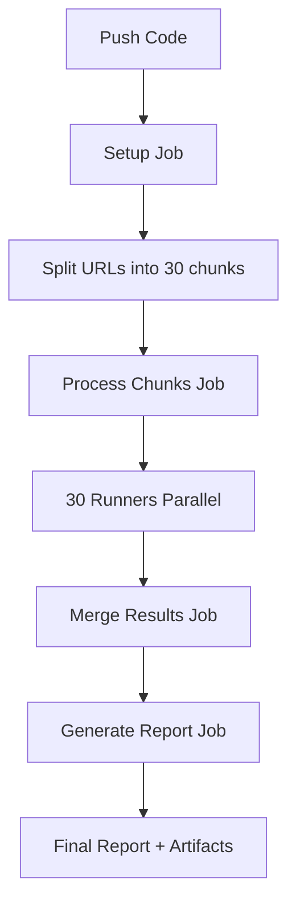

# Parallel Processing Setup cho Playwright Library

Hướng dẫn thiết lập và sử dụng parallel processing để xử lý 3000 URL với 30 runners đồng thời trên GitHub Actions.

## 🚀 Tổng quan

Hệ thống này cho phép bạn:
- Chia 3000 URL thành 30 chunks (mỗi chunk ~100 URLs)
- Chạy 30 runners song song trên GitHub Actions
- Merge kết quả từ tất cả chunks thành một report cuối cùng
- Giảm thời gian xử lý từ vài giờ xuống còn vài phút

## 📁 Cấu trúc Files Mới

```
PlaywrightLibary/
├── helpers/
│   ├── split-urls.js      # Chia URLs thành chunks
│   ├── process-chunk.js   # Xử lý một chunk cụ thể
│   └── merge-results.js   # Merge kết quả từ các chunks
├── chunks/                # Chứa các file chunk (tự động tạo)
├── results/               # Chứa kết quả từng chunk (tự động tạo)
├── .github/workflows/
│   └── parallel-crawl.yml # GitHub Actions workflow
├── test-parallel.js       # Script test local
└── README-PARALLEL.md     # File này
```

## 🛠️ Setup và Chạy

### Bước 1: Test Local (Khuyến nghị)

Trước khi push lên GitHub, test local để đảm bảo mọi thứ hoạt động:

```bash
# Test toàn bộ workflow parallel
npm run test-parallel
```

Script này sẽ:
- ✅ Chia URLs thành chunks
- ✅ Test xử lý 1 chunk
- ✅ Test merge kết quả
- ✅ Cleanup sau khi test

### Bước 2: Push lên GitHub

```bash
git add .
git commit -m "Add parallel processing support"
git push origin main
```

### Bước 3: Chạy trên GitHub Actions

1. Vào repository trên GitHub
2. Chuyển đến tab **Actions**
3. Chọn workflow **"Parallel Crawl Console"**
4. Click **"Run workflow"**
5. Có thể điều chỉnh số chunks (mặc định: 30)
6. Click **"Run workflow"**

## 📊 Monitoring Progress

### Trên GitHub Actions:

1. **Setup Job**: Chia URLs thành chunks
2. **Process Chunks Job**: 30 runners chạy song song
3. **Merge Results Job**: Tổng hợp kết quả
4. **Generate Report Job**: Tạo HTML report

### Kiểm tra từng bước:

- **Artifacts**: Download và xem kết quả từng chunk
- **Logs**: Xem log chi tiết của từng runner
- **Summary**: Xem tổng kết trong GitHub Actions summary

## 🔧 Cấu hình

### Thay đổi số chunks:

```bash
# Local
NUMBER_OF_CHUNKS=20 npm run split

# GitHub Actions
# Trong workflow dispatch, nhập số chunks mong muốn
```

### Thay đổi delay giữa requests:

```javascript
// Trong helpers/process-chunk.js
await timeout(3000); // Thay đổi từ 3000ms thành giá trị khác
```

## 📈 Performance

### So sánh thời gian:

| Method | 3000 URLs | Time |
|--------|-----------|------|
| Sequential | 1 runner | ~2-3 giờ |
| Parallel | 30 runners | ~5-10 phút |

### Tối ưu hóa:

- **Chunk size**: Tự động tính toán dựa trên số URLs
- **Retry logic**: 5 lần retry cho mỗi URL
- **Error handling**: Ghi log lỗi và tiếp tục xử lý
- **Resource management**: Giới hạn 30 runners đồng thời

## 🐛 Troubleshooting

### Lỗi thường gặp:

1. **"Chunk file not found"**
   - Chạy `npm run split` trước
   - Kiểm tra file `input/input.xlsx` tồn tại

2. **"Metadata file not found"**
   - Đảm bảo đã chạy split thành công
   - Kiểm tra thư mục `chunks/`

3. **GitHub Actions timeout**
   - Giảm số chunks xuống 20 hoặc 15
   - Tăng timeout trong workflow

4. **Memory issues**
   - Giảm chunk size
   - Tăng delay giữa requests

### Debug commands:

```bash
# Kiểm tra chunks đã tạo
ls -la chunks/

# Xem metadata
cat chunks/metadata.json

# Test một chunk cụ thể
npm run process-chunk 1

# Xem kết quả chunk
cat results/chunk-1-result.json
```

## 📋 Checklist Trước Khi Chạy

- [ ] File `input/input.xlsx` có dữ liệu hợp lệ
- [ ] Đã test local thành công (`npm run test-parallel`)
- [ ] Code đã push lên GitHub
- [ ] GitHub Actions workflow đã được trigger
- [ ] Có đủ GitHub Actions minutes (cần ~30-60 phút)

## 🎯 Kết quả mong đợi

Sau khi chạy thành công, bạn sẽ có:

1. **Artifacts**:
   - `final-report`: Report tổng hợp
   - `html-report`: HTML report (nếu có generate-report.js)

2. **Files**:
   - `report/project.json`: Report chi tiết
   - `report/summary.json`: Tổng kết
   - `report/images/`: Screenshots từ tất cả browsers

3. **Metrics**:
   - Tổng số URLs đã xử lý
   - Success rate
   - Thời gian xử lý tổng
   - Thời gian xử lý từng chunk

## 🔄 Workflow Steps



## 📞 Support

Nếu gặp vấn đề:
1. Kiểm tra logs trong GitHub Actions
2. Chạy test local để debug
3. Kiểm tra file input có đúng format không
4. Xem troubleshooting section ở trên 